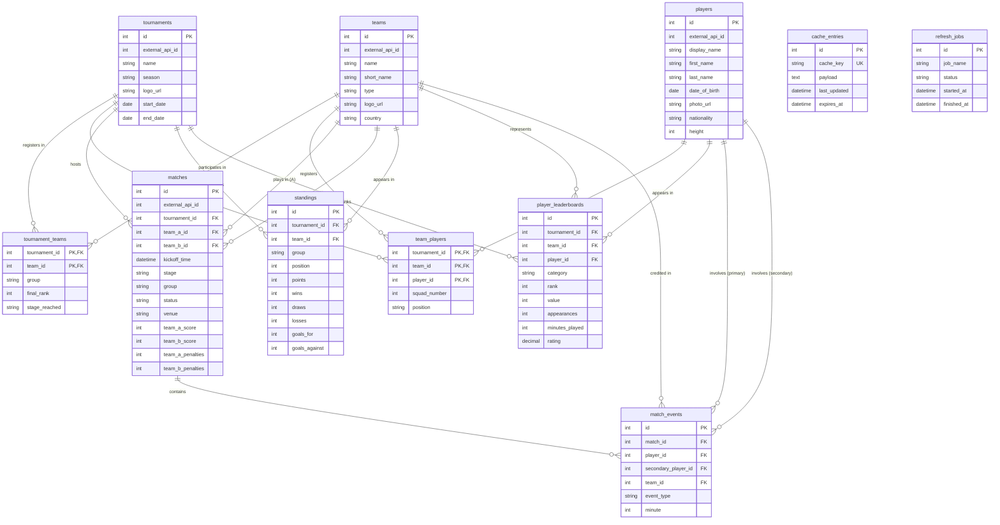

# Entity Relationship Diagram

Visual reference for the v1 PostgreSQL schema. All eleven current tables are shown with their columns, types, and key constraints.

## Relationship notes

| Relationship                       | Cardinality | Participation     | Notes                                                                                                                                          |
| ---------------------------------- | ----------- | ----------------- | ---------------------------------------------------------------------------------------------------------------------------------------------- |
| tournaments → teams                | M:N         | Partial / Partial | Resolved via `tournament_teams`. `group` lives on the junction row.                                                                            |
| tournaments → players              | M:N         | Partial / Partial | Resolved via `team_players`. A player is always registered through a team.                                                                     |
| teams → players                    | M:N         | Partial / Partial | Resolved via `team_players`. `squad_number` and `position` live on the junction row — they are registration attributes, not player attributes. |
| tournaments → matches              | 1:N         | Partial / Total   | A new tournament has no matches yet. Every match must belong to a tournament.                                                                  |
| tournaments → standings            | 1:N         | Partial / Total   | Every standings row must reference a tournament.                                                                                               |
| tournaments → player_leaderboards  | 1:N         | Partial / Total   | Contains tournament-specific player leaderboard rows by category.                                                                              |
| teams → matches (A)                | 1:N         | Partial / Total   | Via `matches.team_a_id`.                                                                                                                       |
| teams → matches (B)                | 1:N         | Partial / Total   | Via `matches.team_b_id`. Two separate FK relationships on the same table.                                                                      |
| teams → standings                  | 1:N         | Partial / Total   | One row per team per tournament group.                                                                                                         |
| teams → player_leaderboards        | 1:N         | Partial / Total   | Captures which team a ranked player represented for the leaderboard entry.                                                                     |
| teams → match_events               | 1:N         | Partial / Total   | Every event is attributed to a team.                                                                                                           |
| players → player_leaderboards      | 1:N         | Partial / Total   | A player can exist with no leaderboard entries yet.                                                                                            |
| players → match_events (primary)   | 1:N         | Partial / Total   | `player_id` is always populated, every event has a primary actor.                                                                              |
| players → match_events (secondary) | 1:N         | Partial / Partial | `secondary_player_id` is nullable, only populated for substitutions and goal-linked assists.                                                   |
| matches → match_events             | 1:N         | Partial / Total   | A scheduled match has no events yet. Every event must reference a match.                                                                       |

## Infrastructure tables

`cache_entries` and `refresh_jobs` have no foreign key relationships. They are standalone infrastructure tables. `cache_entries` stores serialized API-Football responses keyed by a unique cache key, and `refresh_jobs` logs background job execution. See `ARCHITECTURE.md` for caching strategy details.
